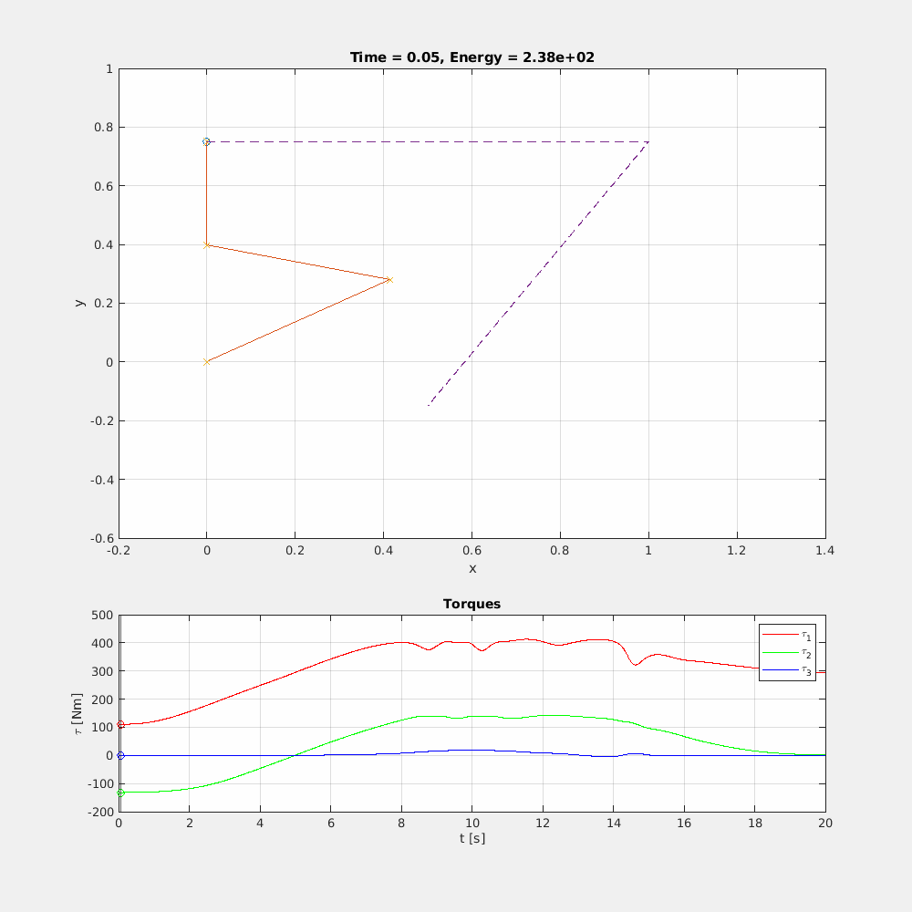

# Task Priority Control of Robot Manipulators

A replication of some of the results in [\[1\]](#reference). A three-link manipulator is
controlled using the proposed method. The highest-priority task is reference
tracking, ensuring that the end effector remains at the desired position. The
second-priority task is maintaining the orientation of the end effector at a
desired angle. The results are shown in the following GIF.



## Run

Run the ```.m``` files in the following order
 1. ```model.m``` To create a representation of the system
 2. ```controller.m``` To create a representation of the controller
 3. ```plot_data.m``` To run a simulation of the system and plot the results

By default the code is set to generate a GIF. This can be turned off by setting
the **save_gif** variable to **false**.

## Reference

**Y. Nakamura, H. Hanafusa, and T. Yoshikawa**, *“Task-Priority Based Redundancy Control of Robot Manipulators,”* The International Journal of Robotics Research, vol. 6, no. 2, pp. 3–15, Jun. 1987, doi: [10.1177/027836498700600201](https://doi.org/10.1177/027836498700600201).

